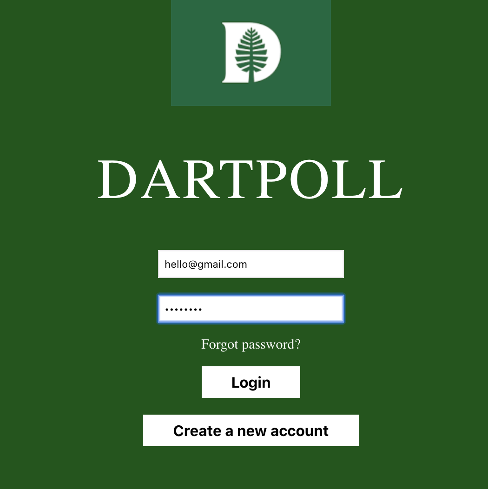
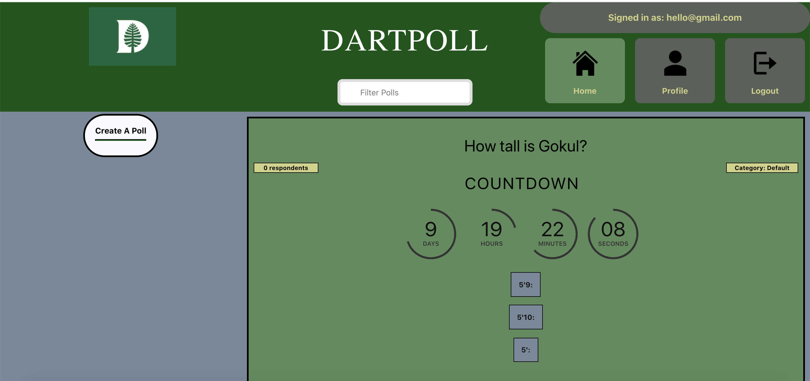
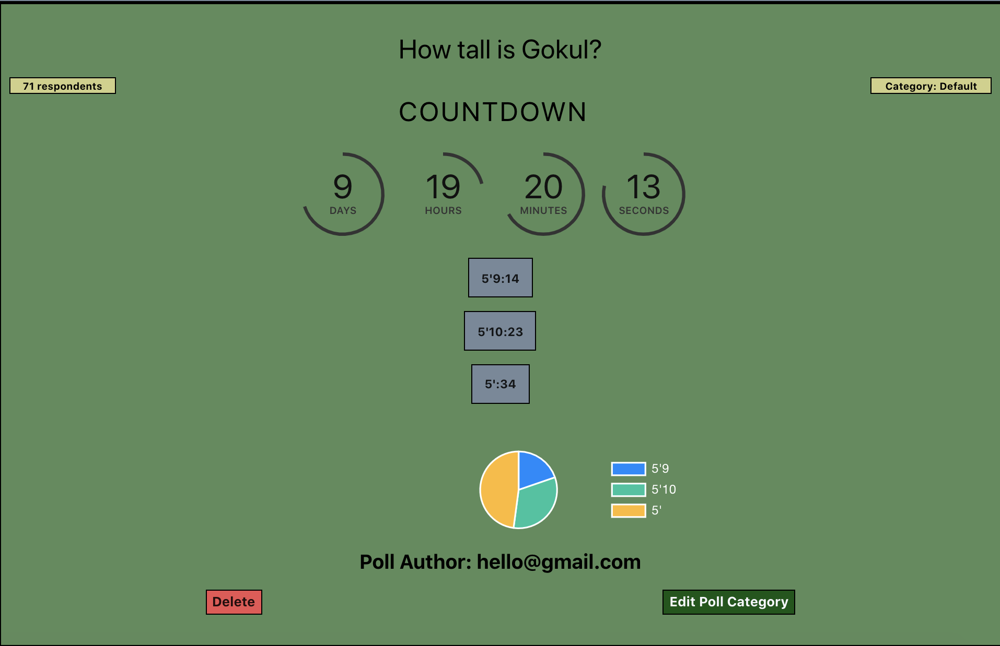
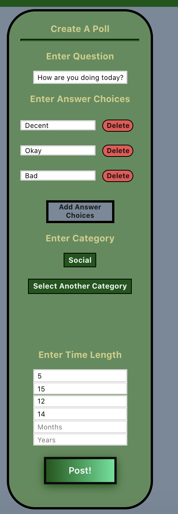
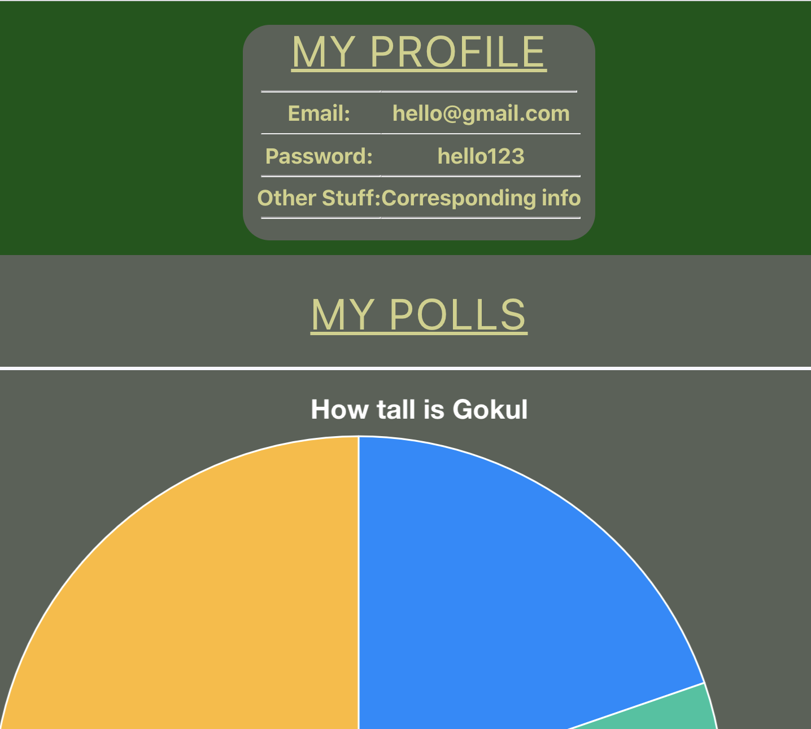

## Project Overview
This project was created under the cooperation of Gokul Srinivasan, Brian Wang, and Dev Kapadia as part of DALI's Mini Web Development Course. Our project, DartPoll, was designed to be used by Dartmouth students as a polling service where students could post and respond to polls. Our project focuses around the administration of polls, and the vizualization of the subsequent poll results. 

## Project Responsibilities

The primary components of the project and their delegations will be listed below

Gokul Srinvasan: 

* Creation and integration of backend with polling app
* Development and implementation of routing system 
* Primary project scaffolding 
* Poll creation and integration with backend
* Voting feature and integration with backend
* Integration of data visualization with backend
* Creation and implementation of authentication
* Interation of timing feature with backend

Brian Wang: 

* Development of basic scaffolding of posting and deleting polls 
* Creation and implementation of time limit feature and visiualization of time limits using Moment.JS and SVG 
* Creation and implementation of voting visualization using Chart.JS
* Assistance in implementing voting visualizations with backend

Dev Kapadia:

* Implementation of all styling

## Main Features

**User Authentication**

We designed a web application that allows for user authentication, storing all of our user data in a Firebase backend. To login, users simply type in their credentials in the respective places. If they do not have an account, they can register a new account that will be added to our backend. 

 

**Home Page**

Once a user logs in they are brought to our home page. On this page, users are able to see all active polls. Users can also click "Create a Poll" if they want to pose their own poll. 



**Polls** 

This is how every polled is displayed on the home page. If the user has not voted in the poll yet, they will be unable to see the results of the poll (to prevent bias). After a user has voted (like in the below image), they are able to see how many people voted for each answer choice and are also able to see a visualization of the poll data. Users can also see a countdown clock that is counting towards the time when the poll will expire. Users also can delete the polls they posted using the "Delete" button. 

 

**Creating a Poll**

If a user clicks "Create a Poll," this box will appear. Here, a user can enter the question they are posing, add as many answer choices as they wish, choose the category of their poll, and set when the poll will expire. 

 

**Profile Page**

If the user clicks the "Profile" button in our top navigation bar, they are brought to a page that shows them their username/password, as well as a visualization of the results of all the polls they have posted. 

 

**Data Visualizations** 

This is the data visualization of a specific poll. To analyze the results between different categories, users can click specific answer choices in the legend to temporarily remove the answer choice from the data visualization. In this case, the "5'9" answer choice has been ruled out and we are looking at the comparison between the votes of "5'10" and "5'". 

 

## How to use DartPoll (on your local machine) 

We have not set-up a website to host DartPoll yet. For now, you can follow these steps to run DartPoll on your local machine. But stay tuned because we will have a working website soon!

**STEP 1**

Open your terminal and change the current working directory to the location where you want your cloned directory. Then type git clone ```https://github.com/msorbaro/coast-to-coast.git``` and hit enter.

**STEP 2**

Once cloned, type in ```yarn``` to build the proper depdencies in our project. Then, type in ```yarn start``` to launch the site locally. 

**STEP 3**

Once at the user page, you can use the username "hello@gmail.com" and the password "hello123" to login. You can also make a new account if you wish. 

**STEP 4**

You're in! Thanks for using DartPoll!


